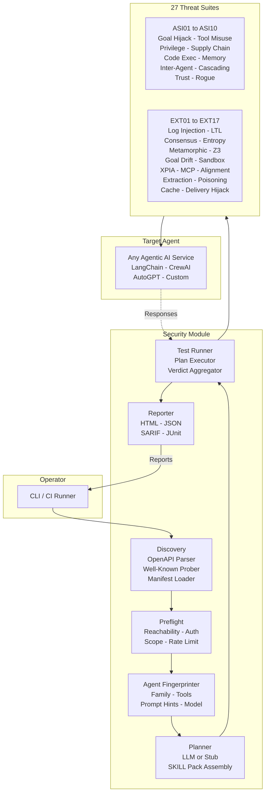
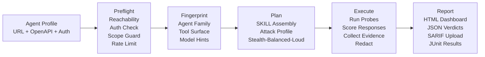
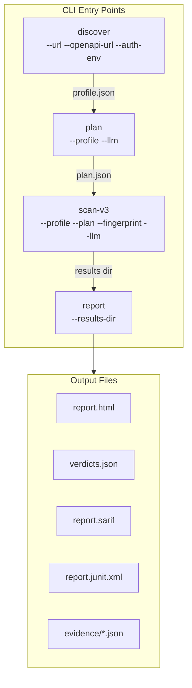
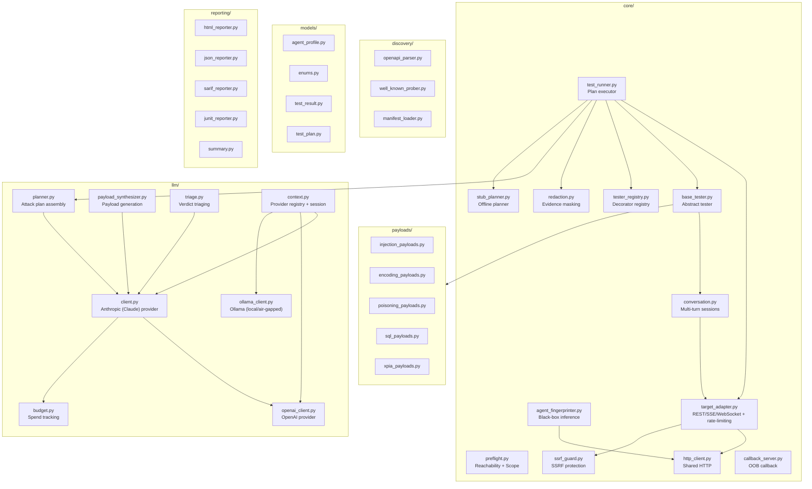
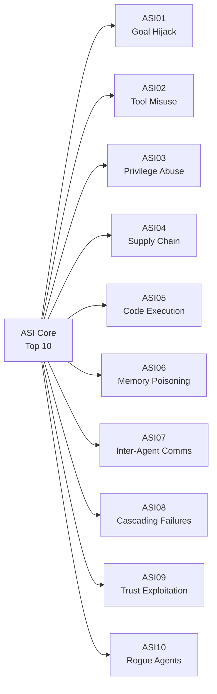
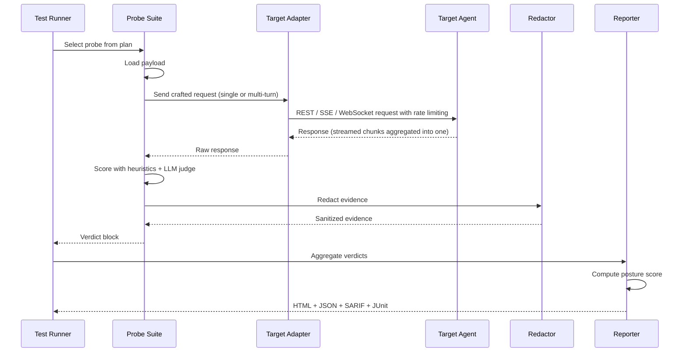
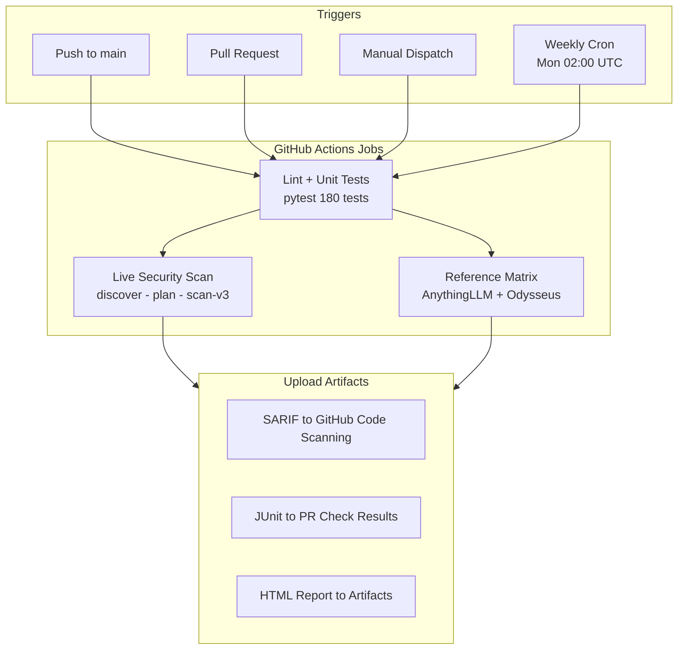

<div align="center">

# 🛡️ security-module

**Agent-Agnostic Safety & Red-Team Evaluation Harness for Agentic AI**

[](https://www.python.org/)
[](LICENSE)
[](https://owasp.org/)
[](tests/)
[](tests_asi/)

---

Point it at **any** agentic-AI service (URL + OpenAPI spec + optional bearer token) — over
**REST, SSE, or WebSocket** — and it probes the target across **27 threat categories**
(ASI01–ASI10 + EXT01–EXT17) with single-shot **and** stateful multi-turn attack chains,
captures evidence, and produces structured **HTML / JSON / SARIF / JUnit** verdicts.

[Getting Started](#-quickstart) · [Architecture](#-architecture) · [Threat Classes](#-threat-classes-covered) · [CI/CD](#-cicd) · [Contributing](CONTRIBUTING.md)

</div>

> ⚠️ **Authorised testing only.** This is offensive security tooling — use responsibly.

---

## 📋 Table of Contents

- [Architecture](#-architecture)
- [End-to-End Pipeline](#-end-to-end-pipeline)
- [Component Architecture](#-component-architecture)
- [Transports & Multi-Turn Sessions](#-transports--multi-turn-sessions)
- [Threat Classes Covered](#-threat-classes-covered)
- [Probe Lifecycle](#-probe-lifecycle)
- [Quickstart](#-quickstart)
- [Configuration](#-configuration)
- [Project Structure](#-project-structure)
- [Agent Fingerprinting & Preflight](#-agent-fingerprinting--preflight)
- [Redaction](#-redaction)
- [CI/CD](#-cicd)
- [Migration Guide](#-migration-guide)
- [License](#-license)

---

## 🏗 Architecture

### High-Level System Overview



---

## 🔄 End-to-End Pipeline



### CLI Commands Flow



---

## 🧩 Component Architecture



---

## 🔌 Transports & Multi-Turn Sessions

The scanner is transport-agnostic: every tester talks to the target through a
`TargetAdapter`, and the runner picks the right one from the profile's
`transport` field. This decouples the 27 attack suites from the wire protocol —
the same probe runs over plain REST or a streamed reply with no suite changes.

| `transport` | Adapter | Use for |
|:------------|:--------|:--------|
| `rest` (default) | `RestAgentAdapter` | Request/response JSON APIs |
| `sse` | `SseAgentAdapter` | Server-Sent Events — OpenAI / Anthropic / LangChain streamed chat completions |
| `websocket` | `WebSocketAgentAdapter` | Agents that answer over a persistent WebSocket |
| `graphql`, `mcp` | stubs | Surface `SKIPPED_TRANSPORT` until implemented |

**Streaming adapters** send one probe, consume the entire multi-chunk reply
(SSE `text/event-stream` frames or WebSocket frames), and **aggregate it into a
single response** — so a tester sees one coherent answer instead of timing out
or catching only the first chunk. Both understand OpenAI-style
`choices[].delta.content` and Anthropic-style `delta.text`, and fall back to a
full-body read if a supposedly-streaming endpoint doesn't actually stream.

**Multi-turn attack chains.** The highest-value attacks against agentic systems
span several turns — goal drift (EXT07), memory poisoning (ASI06), trust
exploitation (ASI09), alignment drift (EXT12). A `ConversationSession`
(`core/conversation.py`) threads one logical conversation so turn *N* genuinely
sees turns *1..N-1*, two ways at once:

- **session continuity** — every turn routes through the same adapter session
  (cookie / transport token), and
- **history replay** — for `messages`-shaped endpoints the accumulated
  user+assistant turns are resent each turn, so even stateless chat-completions
  agents see the whole conversation.

Suites flagged `@register_tester(multi_turn=True)` receive a `SessionHandle`
from the runner and drive it with `self.conversation(session)`. Because
`ConversationSession` goes through the adapter, multi-turn chains work
unchanged over REST, SSE, **or** WebSocket.

**Parallel execution.** The runner partitions a scan: **stateless single-turn**
suites run concurrently (`asyncio.gather`, bounded by `ASI_MAX_CONCURRENT_SUITES`,
default 6), while **clean-state** (`requires_clean_state`) and **multi-turn**
suites run sequentially and in isolation — they mutate session/cookie state or
may DoS the target, so they must not overlap. The adapter's token-bucket still
caps the real request rate across all in-flight suites, so parallelism cuts
wall-clock time without breaching the profile's rate limit. Set
`ASI_MAX_CONCURRENT_SUITES=1` to force fully-sequential execution.

---

## 🎯 Threat Classes Covered

The **27 attack suites** under `tests_asi/` are organized into two tiers:

### ASI Core — OWASP Agentic Security Initiative Top 10



### Extended Suites (EXT01–EXT17)

| Suite | Code | What It Probes |
|:------|:-----|:---------------|
| **Log Injection** | `ext01` | Log forging, CRLF injection, log-based attacks |
| **LTL Chain** | `ext02` | Linear temporal logic chain violations |
| **Consensus Spoofer** | `ext03` | Multi-agent consensus manipulation |
| **Entropy Boundary** | `ext04` | Randomness boundary exploitation |
| **Metamorphic Consistency** | `ext05` | Semantic equivalence bypass |
| **Z3 Constraint Prober** | `ext06` | Formal constraint satisfaction attacks |
| **Goal Drift** | `ext07` | Gradual objective manipulation |
| **Sandbox Isolation** | `ext08` | Container/sandbox escape vectors |
| **FOL Axiom Enforcer** | `ext09` | First-order logic axiom violations |
| **XPIA Indirect Injection** | `ext10` | Cross-plugin indirect prompt injection |
| **MCP Tool Poisoning** | `ext11` | Model Context Protocol tool manipulation |
| **Alignment Checker** | `ext12` | Value alignment drift detection |
| **Model Extraction** | `ext13` | Model weights/behavior extraction |
| **Data Poisoning** | `ext14` | Training/inference data corruption |
| **Attribute Inference** | `ext15` | Private attribute leakage |
| **Cache Poisoning** | `ext16` | Cached-response replay attacks |
| **Delivery Hijack** | `ext17` | Gmail/Slack/webhook delivery hijacking |

---

## 🔬 Probe Lifecycle

Every probe in a suite produces one structured verdict:



### Verdict Schema

```jsonc
{
  "probe_id": "ext1_prompt_injection.payload_05",
  "category": "prompt-injection",
  "severity_proposed": "high",
  "input": {
    "endpoint": "/chat",
    "headers": { "...": "..." },
    "body": { "message": "..." }
  },
  "response": {
    "status": 200,
    "body_snippet": "...",
    "latency_ms": 412
  },
  "verdict": "vulnerable",
  "evidence": [
    {"type": "echo", "match": "secret-token-…", "redacted": true},
    {"type": "behaviour", "note": "Tool send_email fired with attacker-controlled arg"}
  ],
  "suggestion": "Add system-prompt boundary; reject embedded instructions in tool arguments.",
  "correlation_id": "COR-..."
}
```

---

## 🚀 Quickstart

### Prerequisites

- **Python 3.11+**
- A target agentic-AI service with a reachable URL

### Installation

```bash
git clone https://github.com/krishddd/security-module.git
cd security-module

# Full setup: scanner + LLM providers + test tooling
pip install -e ".[llm,dev]"

# Core only (no LLM features):
pip install -r requirements.txt

cp .env.example .env   # set OPENAI_API_KEY / ANTHROPIC_API_KEY + target tokens
```

### Run Tests

```bash
# Unit suite (180 tests)
python -m pytest tests/ -q --ignore=tests/test_scan_v3_live.py
```

### Scan a Target

```bash
# 1. Discover the agent's shape
python cli.py discover --url http://localhost:3001 \
    --openapi-url http://localhost:3001/api-docs/json \
    --auth-env MY_TOKEN --out profile.json

# 2. Build an attack plan
python cli.py plan --profile profile.json --llm --out plan.json

# 3. Run the scan
python cli.py scan-v3 --profile profile.json --plan plan.json --llm --yes

# Air-gapped: use a local Ollama model instead of a cloud API (no key needed)
python cli.py scan-v3 --profile profile.json --plan plan.json \
    --llm --llm-provider ollama --yes
```

`--llm-provider` selects the LLM backend: `auto` (default — Anthropic if its key
is set, else OpenAI), `anthropic`, `openai`, or `ollama` (local, needs a running
`ollama serve`).

### Demo Flows

```bash
# AnythingLLM (Docker, :3001)
pwsh demo/run_anythingllm_demo.ps1

# Odysseus (Docker, :7000)
pwsh demo/run_odysseus_demo.ps1
```

Reports are written to `results/<run_id>/report.html`. Per-run build artifacts go to `.work/` (gitignored).

---

## ⚙️ Configuration

Agent profiles are plain JSON. A minimal profile:

```json
{
  "name": "AnythingLLM demo",
  "target": "http://localhost:3001",
  "openapi": "http://localhost:3001/api-docs/json",
  "transport": "rest",
  "auth": { "type": "bearer", "token_env": "TARGET_TOKEN" },
  "scope": { "allow_hosts": ["localhost"], "deny_hosts": [] },
  "profile": "balanced",
  "tools_allowed": ["chat", "search", "send_email"],
  "rate_limit": { "rps": 2, "max_total": 500 }
}
```

### Attack Profiles

| Profile | Description |
|:--------|:------------|
| `stealth` | Low-volume, evasive probes — avoids triggering WAF/rate-limits |
| `balanced` | Default — covers breadth with moderate volume |
| `loud` | Full-blast — exhaustive coverage, may trigger defenses |

---

## 📁 Project Structure

```
security-module/
├── cli.py                          # Command-line entry-point
├── pyproject.toml                  # Build config + dependencies
├── requirements.txt                # Pinned runtime deps
├── pipeline.yml                    # GitHub Actions CI/CD template
│
├── core/                           # Engine
│   ├── preflight.py                # Reachability + scope + rate-limit checks
│   ├── agent_fingerprinter.py      # Black-box target shape inference
│   ├── test_runner.py              # Plan executor + verdict aggregator
│   ├── target_adapter.py           # REST / SSE / WebSocket adapters + rate-limiting
│   ├── conversation.py             # Multi-turn ConversationSession abstraction
│   ├── base_tester.py              # Abstract tester base class
│   ├── tester_registry.py          # @register_tester decorator
│   ├── redaction.py                # Evidence masking (API keys, JWTs, PII)
│   ├── http_client.py              # Shared HTTP client with retries
│   ├── ssrf_guard.py               # SSRF protection
│   ├── stub_planner.py             # Offline / dry-run planner
│   └── callback_server.py          # OOB callback for code-exec probing
│
├── llm/                            # LLM-assisted features (--llm flag)
│   ├── planner.py                  # Plan assembly from SKILL packs
│   ├── client.py                   # Anthropic (Claude) provider + LLMResponse contract
│   ├── openai_client.py            # OpenAI (GPT) provider
│   ├── ollama_client.py            # Ollama local / air-gapped provider (no API key)
│   ├── payload_synthesizer.py      # LLM-based payload generation
│   ├── triage.py                   # Batched verdict triaging
│   ├── budget.py                   # Spend tracking + hard cap
│   └── context.py                  # Provider registry (--llm-provider) + session context
│
├── discovery/                      # Target discovery
│   ├── openapi_parser.py           # OpenAPI spec parsing
│   ├── well_known_prober.py        # Probe well-known paths
│   └── manifest_loader.py          # Agent manifest loading
│
├── models/                         # Data models (Pydantic)
│   ├── agent_profile.py            # Target profile schema + v2 to v3 migrator
│   ├── enums.py                    # Risk categories + severities
│   ├── test_result.py              # Verdict + report models
│   └── test_plan.py                # Plan schema
│
├── payloads/                       # Static payload libraries
│   ├── injection_payloads.py       # Prompt injection seeds
│   ├── encoding_payloads.py        # Encoding trick payloads
│   ├── poisoning_payloads.py       # Memory/data poisoning payloads
│   ├── sql_payloads.py             # SQL injection payloads
│   └── xpia_payloads.py            # Cross-plugin injection payloads
│
├── reporting/                      # Report generators
│   ├── html_reporter.py            # HTML posture dashboard
│   ├── json_reporter.py            # Machine-readable verdict log
│   ├── sarif_reporter.py           # SARIF for GitHub Code Scanning
│   ├── junit_reporter.py           # JUnit XML for CI integration
│   └── summary.py                  # Posture score calculation
│
├── tests_asi/                      # 27 attack/probe suites (production code)
│   ├── asi01 to asi10              # ASI core suites
│   └── ext01 to ext17             # Extended threat suites
│
├── tests/                          # Unit tests (pytest)
├── demo/                           # Demo scripts + documentation
├── sample_configs/                 # Reference agent profiles
├── liveview/                       # Go-based live scan viewer
├── config/                         # Settings + agent registry
└── results/                        # Per-run reports (gitignored)
```

---

## 🔍 Agent Fingerprinting & Preflight

The pipeline does not assume what's on the other end. Two modules make that explicit:

```mermaid
flowchart LR
    subgraph PF["Preflight Checks"]
        R["Reachability"]
        Auth["Auth Validation"]
        Scope["Scope Guard"]
        Rate["Rate-Limit Budget"]
    end

    subgraph FP["Agent Fingerprinting"]
        Family["Agent Family"]
        Tools["Tool Surface"]
        Prompt["Prompt Template"]
        Model["Model Hints"]
        RateP["Rate-Limit Posture"]
    end

    Target["Target Agent"] --> R
    R --> Auth
    Auth --> Scope
    Scope --> Rate
    Rate --> Family
    Family --> Tools
    Tools --> Prompt
    Prompt --> Model
    Model --> RateP
    RateP --> Plan["Tailored Attack Plan"]
```



- **`core/preflight.py`** — Checks reachability, auth correctness, scope boundaries (refuses out-of-scope hosts), rate-limit budget. Tests: `tests/test_preflight.py`
- **`core/agent_fingerprinter.py`** — Observes target responses and infers: agent family, tool surface, prompt-template hints, model hints, rate-limit posture. Tests: `tests/test_fingerprinter.py`

---

## 🔒 Redaction

`core/redaction.py` runs on every evidence object before persistence. It masks:

- 🔑 API keys & bearer tokens
- 🎫 JWTs & session tokens
- 👤 PII patterns (emails, phone numbers)
- 🏷️ Customer-specific identifiers

The resulting `results/<run_id>/` folder is safe to share with audit teams.

---

## 🔄 CI/CD



The pipeline template lives in `pipeline.yml`. To activate:

```bash
mkdir -p .github/workflows
cp pipeline.yml .github/workflows/security.yml
```

---

## 📖 Migration Guide

See [MIGRATION.md](MIGRATION.md) for the full **v2 → v3** agent-agnostic refactor guide.

Key changes:
- **Agent-agnostic**: No more hardcoded endpoints — everything discovered via OpenAPI
- **`@register_tester` decorator**: Replaces the manual `_MODULE_MAP`
- **LLM-assisted planning**: Optional `--llm` flag for smarter attack plans
- **Auth via env vars**: Tokens never stored inline in config

---

## 📊 Status

Personal portfolio project. Agent-agnostic — designed to be aimed at any production or staging agentic-AI service you own. Talks REST, SSE, or WebSocket, and runs both single-shot and stateful multi-turn attack chains.

## 📝 License

MIT — see [LICENSE](LICENSE) for details.

---

<div align="center">

**Built with ❤️ for the agentic AI security community**

</div>
